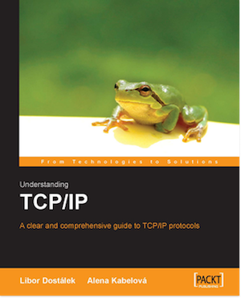

[](https://gitpitch.com/enogrob/ebook-project/master)
```
Roberto Nogueira  
BSd EE, MSd CE
Solution Integrator Experienced - Certified by Ericsson
```
# eBook project



**About**

Learn everything you need to about the subject of this `eBook` project.

[Homepage](https://www.packtpub.com/networking-and-servers/understanding-tcpip)

## Topics
```
1: INTRODUCTION TO NETWORK PROTOCOLS
1.1 ISO OSI
1.2 TCP/IP
1.3 Methods of Information Transmission
1.4 Virtual Circuit
2: NETWORK MONITORING TOOLS
2.1 Packet Drivers
2.2 MS Network Monitor
2.3 Ethereal
2.4 Homework
3: PHYSICAL LAYER
3.1 Serial Line
3.2 Modems
3.3 Digital Circuits
3.4 LAN
4: LINK LAYER
4.1 Serial Line Internet Protocol
4.2 Compressed SLIP
4.3 High-Level Data Link Control Protocol
4.4 Point-To-Point Protocol
4.5 Frame Relay
4.6 Local Area Networks
4.7 Wireless Local Area Network
4.8 Fixed Wireless Access
5: INTERNET PROTOCOL
5.1 IP Datagram
5.2. Internet Control Message Protocol
5.3 Fragmentation
5.4 Optional Entries in the IP Header
5.5 ARP and RARP Protocols
5.6 Internet Group Management Protocol
5.7 Multicast and Link Protocol
6: IP ADDRESS
6.1 Network: First Period of History
6.2 Network: Second Period of History
6.3 IP Addresses in the Intranet and Special-Use IP Addresses
6.4 Unnumbered Interface
6.5 Address Plan
6.6 Over 254 Interfaces in a LAN
7: ROUTING
7.1 Forwarding and Screening
7.2 Routing
7.3 Handling Routing Tables
7.4 Routing Protocols
7.5 Neutral Exchange Point
8: IP VERSION 6
8.1 Next Headers of IP Version 6 Datagram
8.2 ICMP Version 6 Protocol
8.3. IP Addresses
8.4 Windows 2003
9: TRANSMISSION CONTROL PROTOCOL
9.1 TCP Segments
9.2 TCP Header Options
9.3 Establishing and Terminating a Connection with TCP
9.4 Determining the Connection State
9.5 Response Delay Techniques
9.6 Window Technique
9.7 Network Congestion
9.8 The Window Scale Factor
10: USER DATAGRAM PROTOCOL
10.1 Fragmentation
10.2 Broadcasts and Multicasts
11: DOMAIN NAME SYSTEM
11.1 Domains and Subdomains
11.2 Name Syntax
11.3 Reverse Domains
11.4 Resource Records
11.5 DNS Protocol
11.6 DNS Query
12: TELNET
12.1 The NVT Protocol
12.2 Telnet Protocol Commands
12.3 Example of Windows NT Client Communication
12.4 Example of UNIX Client Communication
13: FILE TRANSFER PROTOCOL
13.1 Architecture
13.2 Active Mode of FTP Protocol Communication
13.3 Passive Mode of FTP Protocol Communication
13.4 FTP Commands
13.5 Proxy
13.6 Return Codes
13.7 Abnormal Termination of Data Transfer
13.8 Anonymous FTP
14: HYPERTEXT TRANSFER PROTOCOL
14.1 Client-Server
14.2 Proxy
14.3 Gateway
14.4 Tunnel
14.5 More Intermediate Nodes
14.6 Uniform Resource Identifier
14.7 Relative URI
14.8 The HTTP Request
14.9 The HTTP Response
14.10 Other Header Fields
14.11 Cookie
15: EMAIL
15.1 Email Architecture
15.2 Mail Message Format
15.3 MIME
15.4 SMTP
15.5 ESMTP
15.6 POP3
15.7 IMAP4
16: FORUMS
16.1 Message Format
16.2 NNTP Protocol
17: LIGHTWEIGHT DIRECTORY ACCESS PROTOCOL
17.1 Protocol Principle
17.2 Data Model of LDAP Directory
17.3 LDAP Protocol Data Units
17.4 Server Programs
17.5 Client Programs
17.6 Lightweight Directory Interchange Format
```
